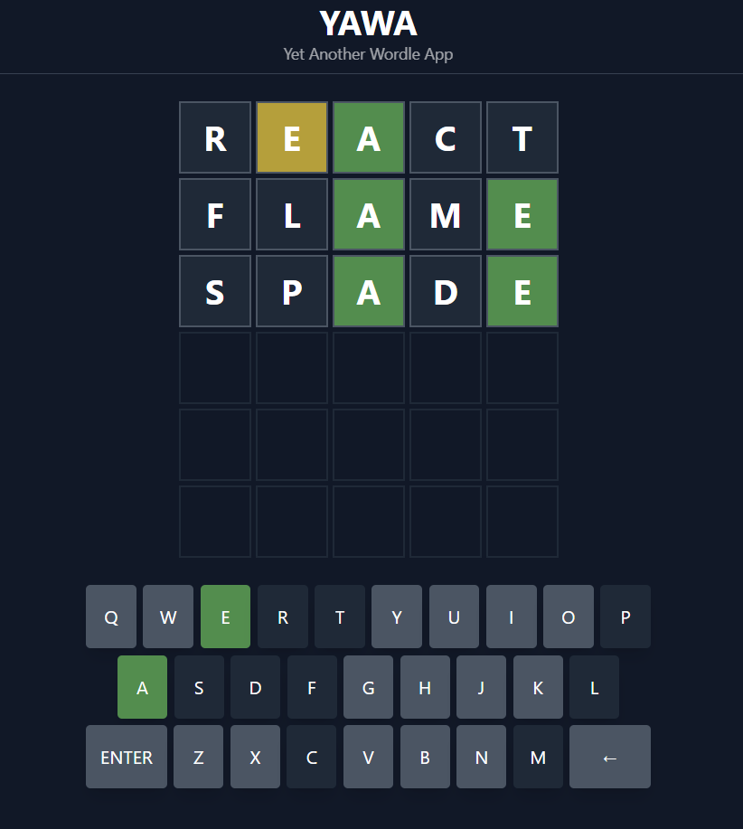

# YAWA: Yet Another Wordle App

Remake of the [Wordle Game App](https://www.nytimes.com/games/wordle/index.html), built with ReactJS and TypeScript and styled with Tailwind CSS.

Try the live version [here](https://yet-another-wordle-app.web.app/).

## Features

- Game state saved to Local Storage.
- Tailwind animations.
- Global state with context api and hooks.

## Let's chat!

I love learning new stuff, so any comments or suggestions are most welcomed.

Also, I love coffee. If you are around, we might try to do one those virtual coffee hangouts (it's totally a thing). Just hit me up!

## Author

- Website - [Erwin Méndez](https://soyerwin.com)
- Twitter - [@ErwinRMendez](https://twitter.com/ErwinRMendez)
